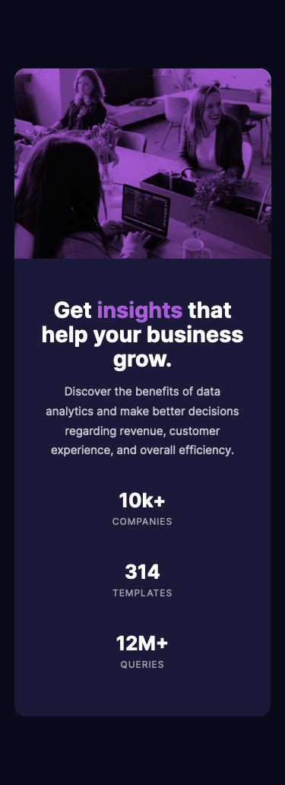

# Frontend Mentor - Stats preview card component solution

This is a solution to the [Stats preview card component challenge on Frontend Mentor](https://www.frontendmentor.io/challenges/stats-preview-card-component-8JqbgoU62). Frontend Mentor challenges help you improve your coding skills by building realistic projects. 

## Table of contents

- [Overview](#overview)
  - [Screenshots](#screenshots)
  - [Links](#links)
- [My process](#my-process)
  - [Built with](#built-with)
  - [What I learned](#what-i-learned)


## Overview

### Screenshots

#### Desktop


#### Mobile



### Links

- Solution URL: [https://github.com/zakhi/stats-preview-card-component-main](https://github.com/zakhi/stats-preview-card-component-main)
- Live Site URL: [https://zakhi.github.io/stats-preview-card-component-main/](https://zakhi.github.io/stats-preview-card-component-main/)

## My process

### Built with

- Mobile-first workflow
- Flexbox
- CSS custom properties


### What I learned

* Blending a background image with a color

```css
  background: #aa5cdb url(../images/image-header-mobile.jpg) center;
  background-blend-mode: multiply;
```
